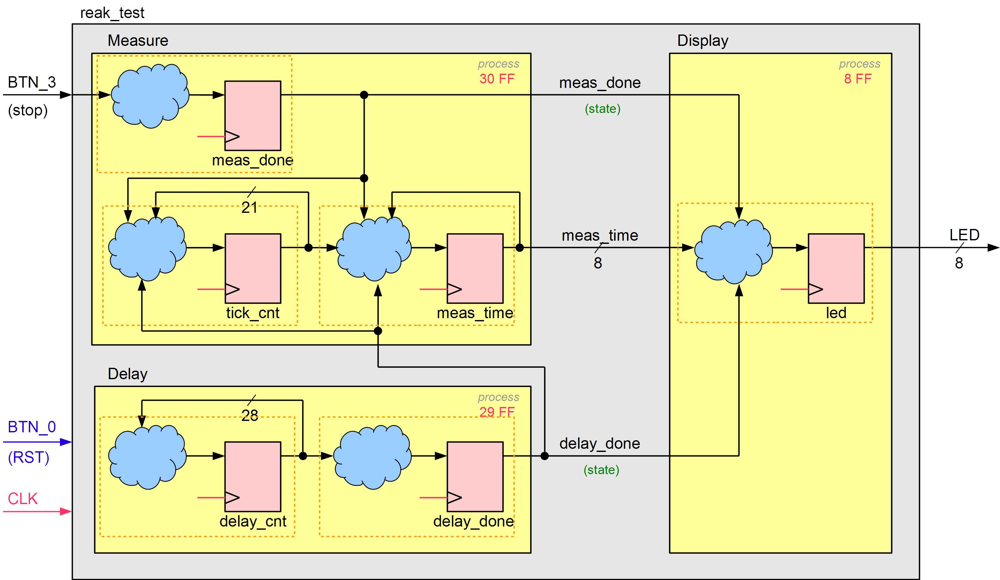

In reak_test.vhd sollen die 3 getakteten Prozesse so vervollständigt werden, dass der Code dem nachfolgenden RTL-Schema <u>**und**</u> der Spezifikation in der Aufgabenstellung entspricht.

Die Signale `delay_done` und `meas_done` sind Control-Signale vom Typ "state" (im Unterschied zum Typ "event"), d.h. sie signalisieren ein bestimmtes Ereignis über eine längere Zeitspane (mehrere Clock-Zyklen). Im vorliegenden Fall bleiben sie im aktiven Zustand bis RST gedrückt wird.

Der Wert des Daten-Signals `meas_time` wird in das Register `led` übernommen, wenn sowohl `delay_done` als auch `meas_done` aktiv sind.

