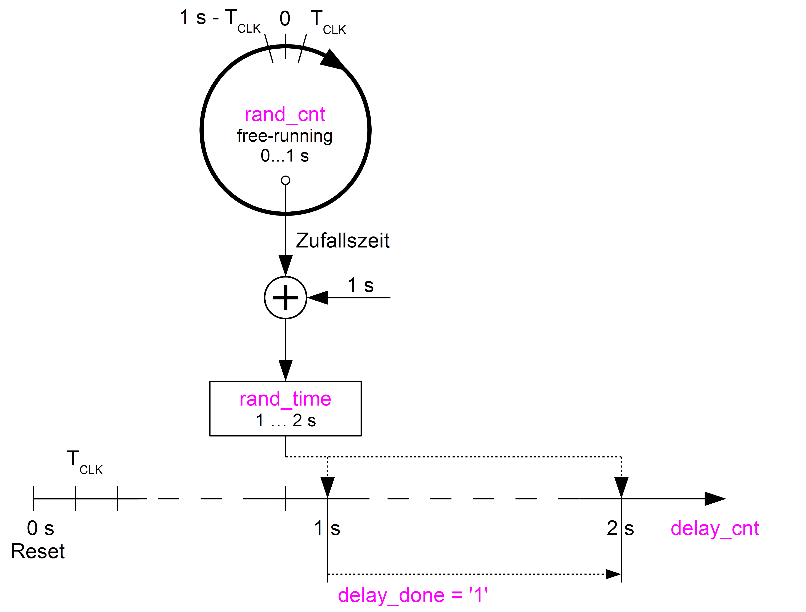
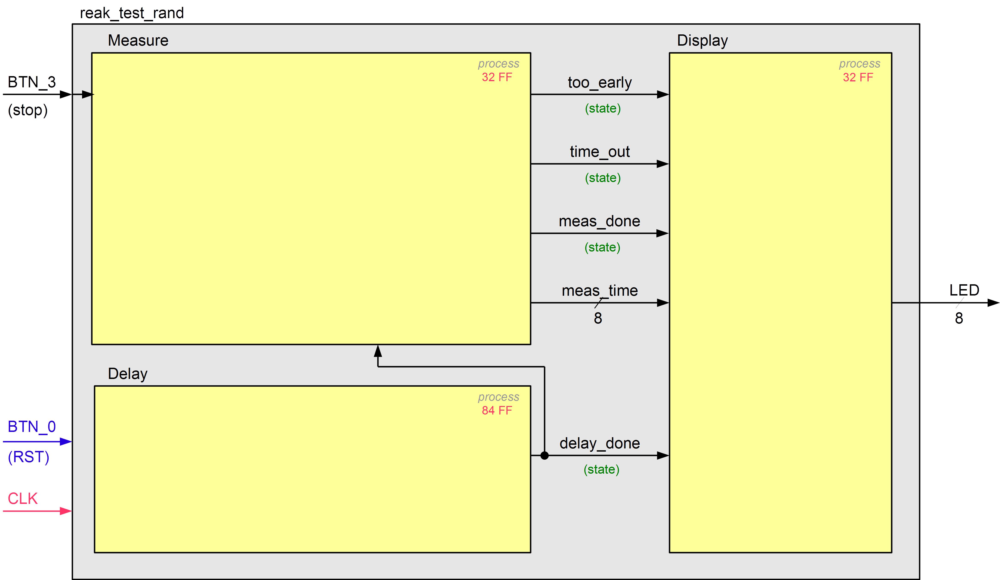

In reak_test_rand.vhd ist der erweiterte Reaktionstester basierend auf dem unten dargestellten Prinzip in 3 getakteten Prozessen  implementiert. 

Das Zähler-Register `rand_cnt` ist ohne Reset implementiert, so dass sein Inhalt nach einer gewissen Zeit nach der FPGA-Konfiguration als Zufallszahl angesehen werden kann. 

Das gegebene Blockdiagramm soll zu einem RTL-Schema vervollständigt werden, so dass dieses der VHDL-Implementierung entspricht.

