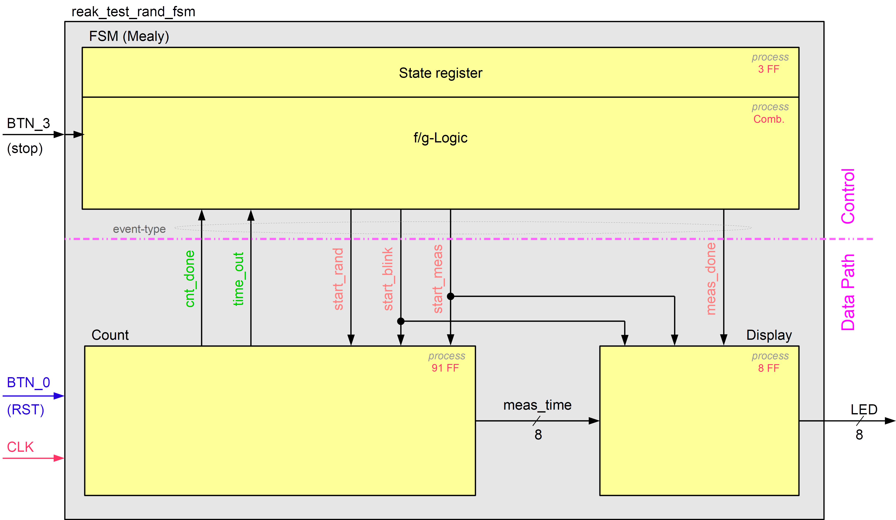

In reak_test_rand_fsm.vhd ist die Implementierung des erweiterten Reaktionstester basierend auf einer FSM gemäss folgendem Blockdiagramm vorbereitet. 

Eine entsprechende FSM vom Typ Mealy soll entworfen (Zustandsdiagramm) und in 2 VHDL-Prozessen implementiert werden.

